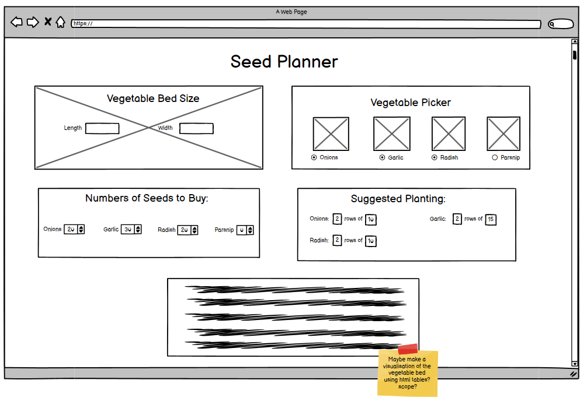

# Seed Calendar

This responsive website is designed to be viewed on a variety of screen sizes. Its purpose is to inform the user which vegetable and flowers seeds can be planted in given months throughout the year, and when they can be harvested.

## Contents

## User Experience
### Initial Discussion
The purpose of the web application is offer users with medium to large sized gardens a way to preview or prepare for the planting of vegetable crops in a way that best utilises space for maximum harvest yield.

## Design
### Wireframes
Wireframes were created for this website for mobile, tablet and desktop screen sizes. The original idea was a set of four interactive areas for the user to supply informaition about their garden and preferred vegetables, and for the application to provide guidance on planting of bulbs.

