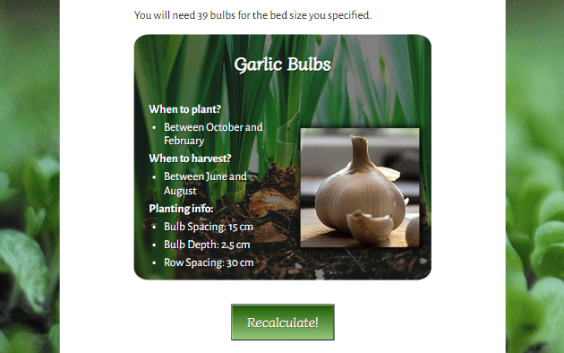

# Seed Planner

This responsive website is designed to be viewed on a variety of screen sizes. Its purpose is to aid the user in planning for the planting of various vegetables in their garden beds, and provide detailed information on how to plant them and when they shgiould plant and harvest them.

Live website on GitHub Pages: [Seed Planner](https://simonhw.github.io/seed-planner/)

 

 

## Contents
- [User Experience](#User-Experience)
    - [Initial Discussion](#Initial-Discussion)
    - [User Stories](#User-Stories)
- [Design](#Design)
    - [Colour Scheme](#Colour-Scheme)
    - [Typography](#Typography)
    - [Wireframes](#Wireframes)
    - [Responsiveness](#Responsiveness)
- [Features](#Features)
    - [Information Section](#Information-Section)
    - [Results Section](#Results-Section)
    - [Javascript](#Javscript)
- [Bugs](#Bugs)
- [Credits](#Credits)

## User Experience
### Initial Discussion
The purpose of the web application is offer users with medium to large sized gardens a way to preview or prepare for the planting of vegetable crops in a way that best utilises space for maximum harvest yield.

### User Stories
#### First-time Visitor Goals
* To understand the purpose of the web application.
* To interact with the input fields without confusion as to their purpose.
* To customise the outputs for their specific needs.
#### Returning Visitor Goals
* To be able to reproduce previous results
* To reference specific planting information for certain vegetables.
#### Frequent Visitor Goals
* To check for updates and improvements to the web application.

## Design
### Colour Scheme
A colour scheme was chosen to reflect tones seen in the garden and the make the user feel excited about working with the earth under a clear blue sky.

### Typography
Two imported Google Fonts were used for this web application: 

- Diphylleia for headings and button text

- Alegreys Sans for paragraph and list content.

Diphylleia was chosen as it evoked thoughts of nature and calming emotions due to its gentle design.
Alegreya Sans was used for the main text content of the web applicaiton as it proved to be more readable when compared to Diphylleia. 

### Imagery
The images used for the web application have perspectives low to the ground, at the level of the plants being planted and grown. These images were chosen as they reflect the desire of the user who wishes to plan their vegetable bed and get down to work in the soil themselves.

### Wireframes
Wireframes were created for this website for mobile, tablet and desktop screen sizes. The original idea was a set of four interactive areas for the user to supply information about their garden and preferred vegetables, and for the application to provide guidance on planting of bulbs. The concept was simplified after a discussion with my CI Mentor and revised to deal with one type of vegetable at a time.

Balsamiq Wireframe for Mobile

Balsamiq Wireframe for Tablet

Balsamiq Wireframe for Desktop

### Responsiveness
- The majority of content is presented from top to bottom as the user views the application on mobile screens. 
- On mobile screens only, a blue background gradient is applied to the H1 heading to add some extra colour to the application.
- On wider screens, a blurred background image is inserted to break up the extra white space and also to focus the user's attention on the input fields in the centre of the page. The blue gradient is removed from the H1 heading.
- To utilise the extra horizontal space, the Vegetable Bed Size input fields are reoriented into a row, and images of vegetables replace the simple radio buttons in the Vegetable Picker div. 
- Likewise in the Results section, the image of the chosen vegetable is no longer underneath the planting details but is presented alongside that content.

The web application viewed on the Galaxy Fold

The web application viewed on wider screens

Differences between input fields on mobile screens and larger sizes

Differences in the Vegetable Card div on mobile screens and larger sizes

## Features
This web application is made up of a single HTML page with a Javascript file and CSS stylesheet.

A favicon of a seedling is used for the HTML page:

Only one of two sections is displayed to the user at any given time: the information gathering section or the results section. When a user first visits or reloads the page, they are presented with the information section only.

### Information Section
In the first set of paragraphs the purpose of the website is presented to the user. Instructions follow on how to properly use the application features and the current limits of the calculations are listed.

Three input options are required of the user:
- the vegetable bed length
- the vegetable bed width
- a choice of one of four vegetables to plant

#### Vegetable Bed Size
The bed size inputs are displayed in a div with a background image of a gardener planting young leafy vegetables. This makes good use of what would otherwise be empty white space for two simple inputs. The use of this image evokes positive thoughts in the user as they identify with the person in the photo and think about their future work in the garden.

A transparent black color is utilised between the image and the white text to aid in contrast. The heading "Vegetable Bed Size" has been given a text shadow to further contrast it from the backround image and add a subtle style to the already attractive font.

A minimium and maximum size of 1 metre and 20 metres respectively was set for these input fields via Javascript as the web application is designed for users with medium to large sized gardens.

CSS code was found and utilised from a post on Stack Overflow to remove the up and down arrows from these number input fields for aesthetic reasons and is [credited below](#Credits).

#### Vegetable Picker
The third option presented to the user is which vegetable to plant. On mobile screens this is a simple horizontal list of radio buttons with labels above. 

On tablet-sized screens and larger I added images of the vegetables and hid the radio buttons. This makes the web application look more professional on larger screen sizes and also helps the user best choose what they want to plant by making them visualise the final result.

Javascript code was written that highlights the image with a green border when that particular vegetable is tapped or clicked. This clearly shows the user what option they have chosen before moving forward to view the results.

#### Calculate and Clear Form Buttons
A large "Calculate" button is the next thing presented to the user after the input fields have been filled out. It uses a gradient of the two green colours chosen for the site as its background colour. The text itself uses the yellow with a text shadow of brown. The colour green is synonymous with progression and affirmation and so is a perfect choice for a button the brings the user to the results page using the data they have provided.

The Clear Form button is smaller and placed a distance away from its sibling to avoid accidental selection by the user. It uses a yellow background with brown text to further distinguish itself as a different type of button. 

### Results Section
#### Planting Suggestions
Under a heading of "Suggested Planting" to make clear to the user what they are describing, paragraphs list properties of the type of vegetable bed the user has specified in the previous section. In the below image, text in red changes based on the user inputs thanks to Javascript functions written to push the correct information for different types of vegetables and bed sizes.

#### Vegetable Card
A neatly-contained div is presented next to the user, summarising the important information needed to plant the user's chosen vegetable. A heading and large image clearly denote the vegetable and the instructions given to the user change depending on their choice.

#### Recalculate Button
A button to send to user back to the previous application state is presented at the bottom of the section. This "Recalculate" button has a similar style to the "Calculate" button, however the font is white with a brown text shadow, and the background gradient moves in the opposite direction.

When returning the user to the information section, this button does not clear the input fields because of the possibility that the user may want to use the same bed size to get results for a different type of vegetable.

### Javascript
#### Validation
The web application uses custom validation to more specifically guide the user when they either forget to provide inputs or to try to use invalid inputs. The `validationCheck();` function returns an alert and/or a boolean to either permit the user to move to the results section or not.
- If all fields are left blank, the user is given clear instructions on how to proceed correctly: 

- If the user tries to use length or width values that are less than 1 or greater than 20, they are reminded of the limits. The input fields are also cleared using `clearSizeInputs();` when this alert is dismissed to make it easier for the user to put in new values:

- If the user does not select any vegetable, they are reminded that this is a required input before proceeding:

#### Vegetable Picker
On wider screens, event listeners added to the four radio buttons use `setGreenBorder();` to add or remove a green border around the vegetable clicked by the user.

#### Calculate Button
When the user clicks the Calculate button, an event listener runs `validationCheck();` and if the inputs are correct, various functions described [below](#Suggested-Planting-Paragraphs) are executed to calculate the appropriate details before running `showResultsPage();` which adds a `display:none` style to the information section and adds `display: flex` to the results section.

#### Clear Form Button
An event listener for the Clear Form button runs the `clearSizeInputs();` and `clearRadioButtons();` functions when clicked. These actions were split into two functions so that one could be used in the validation check as explained above.

#### Suggested Planting Paragraphs
Using a number of functions, namely `checkVegetable();` `calculateArea();` `getVegetableValues();` `calculateRows();` and `calculateBulbsInRow();`, various parts of the paragraphs under "Suggested Planting" will be updated based on the user inputs: 
- the area of the vegetable bed
- the name of the vegetable
- the number of rows and how many vegetables per row
- the spacing between bulbs in the same row
- the depth at which the vegetables should be planted
- the spacing between rows
- how many bulbs or seeds will be needed

(In the below gif image, the fields that change are shown in red just for the purposes of the README)

#### Vegetable Card
Similarly, using `function();` and `insertImage();`, the details in the vegetable card change based on the user's selection:

#### Seeds or Bulbs?
Depending on the vegetable chosen, the user will be given details for the planting of seeds or bulbs. To change these words in the web application, spans with classes and ids were used and the javascript function `bulbsOrSeeds();` called by the Calculate button event listener inserted the correct words using the `.innerText` property.

(In the below gif image, the fields that change are shown in red just for the purposes of the README)

#### Recalculate Button
The event listener for the Recalcualte button simply calls the `showInformationPage();` function when it is clicked. This function removes the `display:none` style from the information section and sets the same style to the results section.

### Features to be Implemented
This web application has great potential to be improved upon and to be able offer users more complicated customisation of inputs for garden planning.
- Use template literals to insert different vegetable options for the user when they select a given month of the year. The `vegetables` object literal can be used to store the blocks of HTML used for the radio buttons to achieve this.
- Allow user to convert the vegetable details card to an image and download to their device or share to other users.
- Allow the user the option to select multiple vegetables for the same plot and customise how much space is dedicated to each type of buld or seed. This will be achieved using custom Javascript functions.
- Add HTML pages dedicated to the seedling growing phase in greenhouses before planting in vegetable beds.

### Accessibility
Accessibilty was kept in mind when building this web application by:
- Using semantic HTML elements where appropriate.
- Using contrasting colours that clearly stand out from the background.
- Including clear and descriptive alt attributes for all `` elements.

## Technologies Used
### Languages
HTML, CSS, and Javascript.

### Frameworks, Libraries, and Programs
Balsamiq - To create the initial wireframes.

Chrome Developer Tools - To visualise and test changes to the HTML and CSS code.

Visual Studio Code - The IDE used to write my code.

Git - For version control.

GitHub - To save and store files online.

Google Fonts - For imported fonts used on the website.

[Favicon.io](https://favicon.io/) - To source the favicon used.

[Pexels.com](https://www.pexels.com/) - To source images used on the website.

[ScreenToGif](https://www.screentogif.com/) - To create gif files for this README.

[TinyPNG](https://tinypng.com/) - To compress images.

Shutter Encoder  - To convert images to .webp format.

GitHub Pages - To host the live version of the website.

[Am I Responsive?](https://ui.dev/amiresponsive) - To showcase the website on different screen sizes for this README.

[Shields.io](https://shields.io/) - To add badges to this README.

[Coolors](https://coolors.co/) - To showcase the colour palette of the website.

## Deployment

The live version of the web application was deployed on GitHub Pages as follows:
  1. Log in or sign up to GitHub.
  2. Navigate to the repository for [Seed Planner](https://github.com/simonhw/seed-planner).
  3. Click the Settings link near the top of the page.
  4. Click on the Pages link on the left-hand side under Code and Automation.
  5. Under Build and Deployment click the dropdown menu for Branches and select 'main'. For the Folder dropdown menu, select 'root'.
  6. Click Save to deploy the website on GitHub Pages.

### Local Deployment
To deploy this project locally on your device, follow the below steps:
#### Forking 
1. Log in or sign up to GitHub.
2. Navigate to the repository for [Seed Planner](https://github.com/simonhw/seed-planner).
3. Click the Fork button located in the top right part of the webpage.
#### Cloning
1. Log in or sign up to GitHub.
2. Navigate to the repository for [Seed Planner](https://github.com/simonhw/seed-planner).
3. Click on the green Code button and select your preferred option of HTTPS, SSH, or GitHub CLI and copy the relevant link.
4. Open the terminal in your IDE and navigate to your directory of choice for this new clone.
5. Type `git clone` into the terminal and paste in your copied link. Press enter.

## Testing
### Manual Testing
### Full Testing
#### Information Section
#### Results Section
### Automated Testing
[W3C]() was used to validate the HTML and CSS files. [JSHint]() was used to validate the Javascript file.
- [index.html]() - Three errors
- [style.css]() - One error
- [script.js]() - One error

### Lighthouse Testing
#### Desktop Tests
#### Mobile Tests
### Accessibility Testing
## Bugs
### Known Bugs
- rowGap for turnip sometimes didn't work?
- On mobile screens, clicking calculate shows you the results section already scrolled down a bit
- vertical scrollbar

### Solved Bugs

## Credits
### Code Used
https://stackoverflow.com/questions/58864049/how-to-get-the-value-of-input-field-in-one-page-and-print-it-in-another-page

https://stackoverflow.com/questions/19159977/inner-border-over-images-with-css 

https://stackoverflow.com/questions/3790935/can-i-hide-the-html5-number-input-s-spin-box

### Content

### Media

## Acknowledgements

### To Do list and notes
Custom input field validation was written in order to avoid the submit button refreshing the page as preventDefault didn't work fully as expected.

The recalculate button does not clear the input fields as the user may wish to simply change the vegetable, not the size of the vegetable bed.

footer ??
- not this version

check validators
- fix hmtl ul ul children

optimise vegetable values function