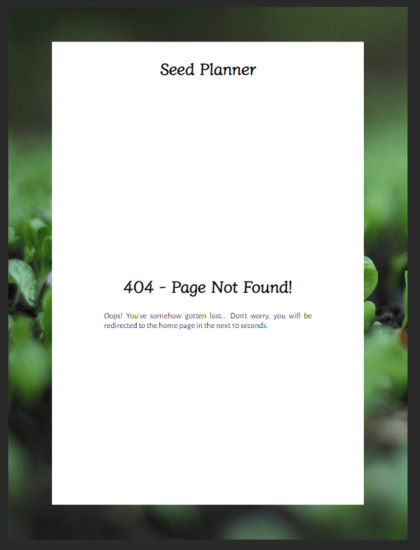
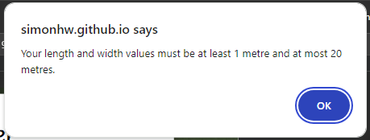
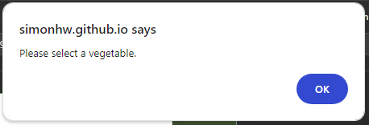
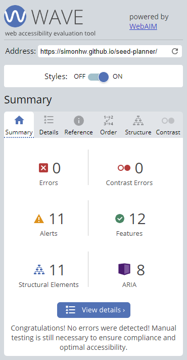

# Seed Planner

This responsive website is designed to be viewed on a variety of screen sizes. Its purpose is to aid the user in planning for the planting of various vegetables in their garden beds, provide detailed information on how to plant them, and when they should plant and harvest them.

Live website on GitHub Pages: [Seed Planner](https://simonhw.github.io/seed-planner/)

 

 

## Contents
- [User Experience](#user-experience)
    - [Initial Discussion](#initial-discussion)
    - [User Stories](#user-stories)
- [Design](#design)
    - [Colour Scheme](#colour-scheme)
    - [Typography](#typography)
    - [Imagery](#imagery)
    - [Wireframes](#wireframes)
    - [Responsiveness](#responsiveness)
- [Features](#features)
    - [Information Section](#information-section)
    - [Results Section](#results-section)
    - [404 Page](#404-page)
    - [Javascript](#javascript)
    - [Features to be Implemented](#features-to-be-implemented)
    - [Accessibility](#accessibility)
- [Technologies Used](#technologies-used)
    - [Languages](#languages)
    - [Frameworks, Libraries, and Programs](#frameworks-libraries-and-programs)
- [Deployment](#deployment)
    - [Local Deployment](#local-deployment)
- [Testing](#testing)
    - [Manual Testing](#manual-testing)
    - [Full Testing](#full-testing)
    - [Automated Testing](#automated-testing)
    - [Lighthouse Testing](#lighthouse-testing)
    - [Accessibility Testing](#accessibility-testing)
- [Bugs](#Bugs)
    - [Known Bugs](#known-bugs)
    - [Solved Bugs](#solved-bugs)
- [Credits](#credits)
    - [Code Used](#code-used)
    - [Content](#content)
    - [Media](#media)
- [Acknowledgements](#acknowledgements)

## User Experience
### Initial Discussion
The purpose of the web application is to offer users with medium to large-sized gardens a tool to preview or prepare for the planting of vegetable bulbs and seeds in a way that best utilises space for maximum harvest yield.

### User Stories
#### First-time Visitor Goals
* To understand the purpose of the web application.
* To interact with the input fields without confusion as to their purpose.
* To learn important information about the vegetables they wish to plant.
#### Returning Visitor Goals
* To be able to reproduce previous results.
* To reference specific planting information for certain vegetables.
#### Frequent Visitor Goals
* To check for updates and improvements to the web application.

## Design
### Colour Scheme
A colour scheme was chosen to reflect tones seen in the garden and make the user feel excited about working with the earth under a clear blue sky.

### Typography
Two imported Google Fonts were used for this web application: 

- Diphylleia for headings and button text

- Alegreys Sans for paragraph and list content.

Diphylleia was chosen as it evoked thoughts of nature and calming emotions due to its gentle design.
Alegreya Sans was used for the main text content of the web application as it proved to be more readable when compared to Diphylleia. 

### Imagery
The images used for the web application have perspectives low to the ground, at the level of the plants being planted and grown. These images were chosen as they reflect the desire of the user who wishes to plan their vegetable bed and get down to work in the soil themselves.

### Wireframes
Wireframes were created for this website for mobile, tablet and desktop screen sizes. The original idea was a set of four interactive areas for the user to supply information about their garden and preferred vegetables, and for the application to provide guidance on planting of bulbs. The concept was simplified after a discussion with my CI Mentor and revised to deal with one type of vegetable at a time.

Balsamiq Wireframe for Mobile

Balsamiq Wireframe for Tablet

Balsamiq Wireframe for Desktop

### Responsiveness
- The majority of content is presented from top to bottom as the user views the application on mobile screens. 
- On mobile screens, a blue background gradient is applied to the H1 heading to add some extra colour to the application.
- On wider screens, a blurred background image is inserted to break up the extra white space and also to focus the user's attention on the input fields in the centre of the page. The blue gradient is removed from the H1 heading.
- To utilise the extra horizontal space, the Vegetable Bed Size input fields are reoriented into a row, and images of vegetables replace the simple radio buttons in the Vegetable Picker div. 
- Likewise in the Results section, the image of the chosen vegetable is no longer underneath the planting details but is presented alongside that content.

The web application viewed on the Galaxy Fold

The web application viewed on wider screens

Differences between input fields on mobile screens and larger sizes

Differences in the Vegetable Card div on mobile screens and larger sizes

Differences in the 404 Page on mobile screens and larger sizes

## Features
This web application consists of two HTML pages, a Javascript file, and a CSS stylesheet.

The use of a header and nav bar was initially considered for this project; however, seeing as the main content of the web application was being designed all on one HTML page, and one aim was to make the user feel like they are using a slick and professional web app, it was decided to omit these types of features from this first version of the project. 

A favicon of a seedling is used for both HTML pages:

### Index.html
Only one of two sections is displayed to the user at any given time: the information gathering section or the results section. When a user first visits or reloads the page, they are presented with the information section only.

### Information Section
In the first set of paragraphs the purpose of the website is presented to the user. Instructions follow on how to properly use the application features and the current limits of the calculations are listed.

Three input options are required of the user:
- the vegetable bed length
- the vegetable bed width
- a choice of one of four vegetables to plant

#### Vegetable Bed Size
The bed size inputs are displayed in a div with a background image of a gardener planting young leafy vegetables. This makes good use of what would otherwise be empty white space for two simple inputs. The use of this image evokes positive thoughts in the user as they identify with the person in the photo and think about their future work in the garden.

A transparent black color is utilised between the image and the white text to aid in contrast. The heading "Vegetable Bed Size" has been given a text shadow to further contrast it from the background image and add a subtle style to the already attractive font.

A minimum and maximum size of 1 metre and 20 metres respectively was set for these input fields via Javascript as the web application is designed for users with medium to large-sized gardens. The user can enter values to a precision of 0.1 metres, and the input fields were made wide enough to display the widest combination of characters, e.g. 17.5.

CSS code was found and utilised from a post on Stack Overflow to remove the up and down arrows from these number input fields for aesthetic reasons and is [credited below](#Credits).

#### Vegetable Picker
The third option presented to the user is which vegetable to plant. On mobile screens, this is a simple horizontal list of radio buttons with labels above them. 

On tablet-sized screens and larger I added images of the vegetables and hid the radio buttons. This makes the web application look more professional on larger screen sizes and also helps the user best choose what they want to plant by making them visualise the final result.

Javascript code was written that highlights the chosen vegetable's image with a green border when it is tapped or clicked. This clearly shows the user what option they have chosen before moving forward to view the results.

#### Calculate and Clear Form Buttons
A large Calculate button is the next thing presented to the user after the input fields. It uses a gradient of the two green colours chosen for the site as its background colour. The text itself uses the yellow colour with a text shadow using the brown colour. Green is synonymous with progression and affirmation and so is a perfect choice for a button that directs the user to the results section using the data they have provided.

The Clear Form button is smaller and placed a distance away from its sibling to avoid accidental selection by the user. It uses a yellow background with brown text to further distinguish itself as a different type of button. 

#### Footer
A simple footer was included at the bottom of each section with a link inviting the user to contact the site owners with any questions or suggestions. This footer was styled minimally so that it did not draw too much attention from the main content of the web application.

### Results Section
#### Planting Suggestions
Under a heading titled "Suggested Planting" which makes clear to the user what they are about to read, paragraphs list properties of the type of vegetable bed the user has specified in the previous section. In the below image, the text shown in red changes based on the user inputs thanks to Javascript functions written to push the correct information for different types of vegetables and bed sizes. The red colour is not present on the live site.

#### Vegetable Card
A neatly contained div is presented next to the user, summarising the important information needed to plant the user's chosen vegetable. A heading and large image indicate the vegetable chosen. The instructions given to the user change depending on their chosen inputs.

#### Recalculate Button
A button to send the user back to the previous application state is presented at the bottom of the section. This Recalculate button has a similar style to the Calculate button; however, the font is white with a brown text-shadow, and the background gradient moves in the opposite direction.

When returning the user to the information section, this button does not clear the input fields because of the possibility that the user may want to use the same bed size inputs to get results for a different type of vegetable.

### 404 Page
The 404 page was added just in case a user tries to navigate to a non-existent address from the web application, even though there are no clickable internal links in index.html. The page automatically redirects the user back to index.html, and they are informed of this in the paragraph under the "404 - Page Not Found!" heading.

### Javascript
#### Validation
The web application uses custom validation to more specifically guide the user when they either forget to provide inputs or try to use invalid inputs. The `validationCheck();` function returns an alert and/or a boolean to either permit the user to move to the results section or not.
- If all fields are left blank, the user is given clear instructions on how to proceed correctly: 
    

- If the user tries to use length or width values that are less than 1 or greater than 20, they are reminded of the limits. When this alert is dismissed, the two input fields are cleared using `clearSizeInputs();` to make it easier for the user to put in new values:
    

- If the user does not select any vegetable, they are reminded that this is a required input before proceeding:
    

#### Vegetable Picker
On wider screens, event listeners added to the four radio buttons use `setGreenBorder();` to add or remove a green border around the vegetable clicked by the user.

#### Calculate Button
When the user clicks the Calculate button, an event listener runs `validationCheck();` and if the inputs are correct, various functions described [below](#Suggested-Planting-Paragraphs) are executed to calculate the appropriate details before running `showResultsPage();` which adds a `display:none` style to the information section and adds `display: flex` to the results section. It also scrolls the user to the top of the window using `window.scrollTo(0,0);`.

#### Clear Form Button
An event listener for the Clear Form button runs the `clearSizeInputs();` and `clearRadioButtons();` functions when clicked. These actions were split into two functions so that one could be used in the validation check as explained above.

#### Suggested Planting Paragraphs
Using several functions, namely `insertAreaValues();`, `insertVegetableNames();`, `insertRowDetails();`, and `insertVegetableProperties();`, various parts of the Suggested Planting paragraphs under will be updated based on the user inputs: 
- the area of the vegetable bed
- the name of the vegetable
- the number of rows and how many vegetables can be planted per row
- the spacing between vegetables in the same row
- the depth at which the vegetables should be planted
- the spacing between rows
- how many bulbs or seeds will be needed

(In the below gif image, the fields that change are shown in red just for the README)

#### Vegetable Card
Similarly, using `insertVegetableNames();`, `insertVegetableProperties();`, and `insertImage();`, the details in the vegetable card change based on the user's selection:

#### Seeds or Bulbs?
Depending on the vegetable chosen, the user will be given details for the planting of seeds or bulbs. To change these words in the web application, spans with classes and ids were used and the javascript function `bulbsOrSeeds();` called by the Calculate button event listener inserted the correct words using the `.innerText` property.

(In the below gif image, the fields that change are shown in red just for the README)

#### Recalculate Button
The event listener for the Recalculate button simply calls the `showInformationPage();` function when it is clicked. This function removes the `display:none` style from the information section and sets the same style to the results section. It also scrolls the user to the top of the window using `window.scrollTo(0,0);`.

### Features to be Implemented
This web application has great potential to be improved upon and offer users more complicated customisation of inputs for garden planning.
- Use template literals to insert different vegetable options for the user when they select a given month of the year. The `vegetables` object literal can be used to store the blocks of HTML used for the radio buttons to achieve this.
- Allow users to convert the vegetable details card to an image and download it to their device or share it with other users.
- Allow the user the option to select multiple vegetables for the same plot and customise how much space is dedicated to each type of bulb or seed. This could be achieved using custom Javascript functions.
- Add HTML pages dedicated to the seedling growing phase in greenhouses before planting in vegetable beds.
- Add a header with a nav bar once the application has more than one HTML page intended for the user to view.
- Store the `vegetables` object in its own .js or .json file as it grows in size so that the main script.js code will be kept neat.

### Accessibility
Accessibility was kept in mind when building this web application by:
- Using semantic HTML elements where appropriate.
- Using contrasting colours that stand out from the background.
- Including clear and descriptive alt attributes for all `` elements.
- Using aria labels to describe the actions that will be taken when interacting with links. This is shown in the email address links in the footers in index.html.

## Technologies Used
### Languages
HTML, CSS, and Javascript.

### Frameworks, Libraries, and Programs
Balsamiq - To create the initial wireframes.

Chrome Developer Tools - To visualise and test changes to the HTML and CSS code.

Visual Studio Code - The IDE used to write my code.

Git - For version control.

GitHub - To save and store files online.

Google Fonts - For imported fonts used on the website.

[W3Schools.com](https://www.w3schools.com/) - For researching and learning about Javascript methods and syntax.

[Favicon.io](https://favicon.io/) - To source the favicon used.

[Pexels.com](https://www.pexels.com/), [Unsplash.com](https://unsplash.com/) - To source images used on the website.

[ScreenToGif](https://www.screentogif.com/) - To create gif files for this README.

Adobe Photoshop 2020 - To crop and resize images.

[TinyPNG](https://tinypng.com/) - To compress images.

Shutter Encoder  - To convert images to .webp format.

GitHub Pages - To host the live version of the website.

[Am I Responsive?](https://ui.dev/amiresponsive) - To showcase the website on different screen sizes for this README.

[Shields.io](https://shields.io/) - To add badges to this README.

[Coolors](https://coolors.co/) - To showcase the colour palette of the website.

## Deployment

The live version of the web application was deployed on GitHub Pages as follows:
  1. Log in or sign up to GitHub.
  2. Navigate to the repository for [Seed Planner](https://github.com/simonhw/seed-planner).
  3. Click the Settings link near the top of the page.
  4. Click on the Pages link on the left-hand side under Code and Automation.
  5. Under Build and Deployment click the dropdown menu for Branches and select 'main'. For the Folder dropdown menu, select 'root'.
  6. Click Save to deploy the website on GitHub Pages.

### Local Deployment
To deploy this project locally on your device, follow the below steps:
#### Forking 
1. Log in or sign up to GitHub.
2. Navigate to the repository for [Seed Planner](https://github.com/simonhw/seed-planner).
3. Click the Fork button located in the top right part of the webpage.
#### Cloning
1. Log in or sign up to GitHub.
2. Navigate to the repository for [Seed Planner](https://github.com/simonhw/seed-planner).
3. Click on the green Code button and select your preferred option of HTTPS, SSH, or GitHub CLI and copy the relevant link.
4. Open the terminal in your IDE and navigate to your directory of choice for this new clone.
5. Type `git clone` into the terminal and paste in your copied link. Press enter.

## Testing
### Manual Testing
| User Stories | Achieved By: | Supporting Images |
| --- | --- | --- |
| **First-time Visitor Goals** |||
| To understand the purpose of the web application. | The words "Seed Planner" in the main heading immediately infer to the user that they are about to use an interactive web application. The introductory paragraphs are kept short and to the point to inform the user about the web application's purpose and how to correctly use it. A large green "Calculate" button makes the user think that there is more content to see once they provide some personalised details.| [1. Instructions Paragraphs Image](assets/images/readme/instructions.png) [2. Calculate Button Image](assets/images/readme/information-buttons.png) |
| To interact with the input fields without confusion as to their purpose. | The input fields are presented clearly to the user, without any major distraction. It is clear that the user should fill in two length values in the Vegetable Bed Size div, and the heading of "Vegetable **Picker**" tells the user that they need to interact with the radio buttons or vegetable images before proceeding. | [1. Input Fields on Mobile Screens Image](assets/images/readme/input-fields-mobile.png) [2. Input Fields on Wider Screens Image](assets/images/readme/input-fields-tablet.png) |
| To learn important information about the vegetables they wish to plant. | The user is presented with customised information about their chosen vegetable in the results section. Any novice gardener will be able to use the application to plant the vegetables without being overwhelmed with too many details. | [Suggested Planting Paragaphs Image](assets/images/readme/suggested-planting-black.png) |
| **Returning Visitor Goals** |||
| To be able to reproduce previous results | With just three inputs required of the user, there is no risk that they will not be able to reproduce previous results, as long as they remember what vegetable bed size they chose. This goal is also achieved in the same user session by not clearing the input fields when the recalculate button is pressed.  |[Input Fields Image](assets/images/readme/input-fields-mobile.png) |
| To reference specific planting information for certain vegetables. | A brightly-coloured vegetable card is presented to the user which succinctly lists the important planting factors, including a large image of the vegetable. This is a positive experience for the returning user who may not wish to read through the Suggested Planting paragraphs again. | [Vegetable Card Image](assets/images/readme/vegetable-card.png) |
| **Frequent Visitor Goals** |||
| To check for updates and improvements to the web application. | The straightforward layout of the web application allows frequent users to easily notice if major changes or updates have been made. The use of informative headings means that any new input fields required of the user would not be easily overlooked. The footer provides a link for the user to get in touch and ask questions or even make suggestions. | [Footer Link Image](assets/images/readme/footer.png)|

### Full Testing
The web application was tested on a Windows 10 desktop with a 26" monitor and on a One Plus 9 Pro mobile phone. Other types of devices were tested using Chrome Developer Tools.

The site was tested on Google Chrome, Mozilla Firefox, and Edge on desktop, and Google Chrome and DuckDuckGo on mobile.

| Feature | Expected Outcome | Test Used | Result | Test Status |
| --- | --- | --- | --- | --- |
| Length Input Field | When clicked, the user can enter data using the keyboard. | Field clicked | Cursor appears in the field | Pass |
| Length Input Field | When selected, the user can only enter numbers. | Entry of letters, symbols, and spaces attempted. | None of these characters appeared in the field. | Pass |
| Length Input Field | When selected, the user can use the up and down arrow keys on the keyboard to increase or decrease the values between 1 and 20 in steps of 0.1. | Up and down arrow keys pressed. | The values increase and decrease in steps of 0.1 with a minimum value of 1 and a maximum value of 20. | Pass |
| Width Input Field | When clicked, the user can enter data using the keyboard. | Field clicked | Cursor appears in the field | Pass |
| Width Input Field | When selected, the user can only enter numbers. | Entry of letters, symbols, and spaces attempted. | None of these characters appeared in the field. | Pass |
| Width Input Field | When selected, the user can use the up and down arrow keys on the keyboard to increase or decrease the values between 1 and 20 in steps of 0.1. | Up and down arrow keys pressed. | The values increase and decrease in steps of 0.1 with a minimum value of 1 and a maximum value of 20. | Pass |
Vegetable Radio Buttons | When clicked, the radio button is selected and any previously selected radio button is unchecked. | Each radio button clicked in turn. | Only one radio button was able to be selected at any given time. | Pass |
Vegetable Radio Buttons | On wider screens, when a vegetable image was clicked, a green border appeared around the image. Any green border on a previously selected image was removed in the same instance. | Each vegetable image clicked in turn. | Only one image was shown with a green border at any given time. | Pass |
| Calculate Button | When the user clicks the button without completing any of the three input options, an alert is displayed reminding them of the instructions for using the web application and the user is not directed to the results section. | Button clicked with no input fields completed. | An alert is displayed reminding the user of the instructions for using the web application. The user is not directed to the results section. | Pass |
| Calculate Button | When the user clicks the button after completing just one of the two size input fields, an alert is displayed reminding them of the instructions for using the web application and the user is not directed to the results section. | Button clicked with only one size input field completed. | An alert is displayed reminding the user of the instructions for using the web application. The user is not directed to the results section. | Pass |
| Calculate Button | When the user enters a value less than 1 or greater than 20 into the size input fields, an alert will display reminding them of the value limits and clear the input fields when dismissed. The user will not be directed to the results section. | Button clicked with values less than 1 and/or greater than 20 entered into the size input field. | An alert displays reminding the user of the value limits and clears the input fields when dismissed. The user is not directed to the results section. | Pass |
| Calculate Button | When the user correctly fills in the size input fields but does not select a vegetable, an alert is displayed reminding them to choose a vegetable and the user is not directed to the results section. | Button clicked with size input fields filled out correctly but no vegetable selected. | An alert displays reminding the user to choose a vegetable. The user is not directed to the results section. | Pass |
Calculate Button | When the user correctly fills out the size input fields and selects a vegetable, the information section is hidden and the results section is displayed. | Button clicked with input fields filled out correctly and a vegetable radio button checked. | The information section is hidden and the results section is displayed. | Pass |
| Clear Form Button | When the user clicks the button, any value in the size input fields are cleared and the radio buttons are unchecked. On wider screens, any green borders around the vegetable images are removed. | Button clicked when values are present in the size input fields and a vegetable is selected. | The size input fields are cleared and the vegetable radio buttons or green borders are unchecked/removed. | Pass |
| Clear Form Button | When the user clicks the Clear Form button when no values are present in the size input fields and no vegetable radio button is selected, no changes are observed on the site. | Button clicked when no values are present in the size input fields and no vegetable radio button is selected. | No changes observed. | Pass |
| Contact Us Link #1 | When clicked, the user is redirected to an email app with the email address populated in the To field | Link clicked | Email app opened with email in To field | Pass |
| Recalculate Button | When clicked, the results section is hidden and the information section is displayed, with the user's previous inputs still present in their respective fields. | Button clicked. | The results section is hidden and the information section is displayed again with the user's previous inputs still present in their respective fields. | Pass |
| Contact Us Link #2 | When clicked, the user is redirected to an email app with the email address populated in the To field | Link clicked | Email app opened with email in To field | Pass |
| 404 Page | After the page loads, the user is redirected to index.html after 10 seconds. | Page observed for more than 10 seconds. | 404 page redirects to index.html after 10 seconds. | Pass |

### Automated Testing
[W3C](https://validator.w3.org/) was used to validate the HTML and CSS files. [JSHint](https://jshint.com/) was used to validate the Javascript file.
- [index.html](assets/images/readme/testing/w3c-index.png) - Passed. Five info messages are shown for the `` elements: "Trailing slash on void elements has no effect and interacts badly with unquoted attribute values."
- [404.html](assets/images/readme/testing/w3c-404.png)
- [style.css](assets/images/readme/testing/w3c-style.png) - Passed with four [warnings](assets/images/readme/testing/w3c-style-warnings.png) about vendor elements. These are included to remove the up and down arrows in the number input fields in the information section. 
- [script.js](assets/images/readme/testing/jshint-metrics.png) - Passed with no warnings.

### Lighthouse Testing
The Lighthouse feature in Chrome Developer Tools was used to test the performance, accessibility, best practices, and search engine optimisation qualities of the web application.

#### Index Page
The desktop and mobile tests for the index page were excellent with all scores between 90 and 100.

Desktop Test:

Mobile Test:

#### 404 Page
The desktop and mobile performance, best practices, and search engine optimisation tests for the 404 page were excellent with scores between 99 and 100.

The accessibility test had a satisfactory score of 84. This score could be higher if not for the presence of an automatic redirect on the page; however, since this is an intentional feature to bring the user back to the home page, the results overall are very acceptable.

Desktop Test:

Mobile Test:

### Accessibility Testing
[Wave](https://wave.webaim.org/) was used to check the web application for errors and issues associated with accessibility.
The results for each page are shown below.

#### Index.html
The page passed with no errors.

- There is one alert for a redundant link. This is the email link in the second footer. There are two links and two footers due to the design of the sections differing between mobile screens and larger screens.

    

- There are ten alerts for justified paragraph text. The paragraphs look more presentable when using this text alignment style, and the negative impact on readability that can sometimes be associated with this style ("varying word/letter spacing and 'rivers of white' that flow through the text") was not observed in the web application.

    

- There was initially an alert for a missing fieldset around the group of radio buttons. It was determined that the purpose of the radio buttons was explained by the heading "Vegetable Picker", so the fieldset was omitted. To satisfy accessibility requirements, the parent div was given the attributes `role="radiogroup"` and `aria-label="Vegetable Picker` to aid screen reader users. The alert no longer appears for the current version of the web application.

    

- To improve accessibility and not sacrifice the existing code structure, the use of `aria-labelledby` was utilised for each radio button to make sure users of screen readers would know which button they were interacting with. 

#### 404.html
There was one error found.

- Wave flagged the 10-second automatic redirect as an error on this page. This is an intended design feature and adds to the user experience as there are no other links or content on this page for them to interact with. This error was therefore not regarded as a failing point for the page's Wave test.
    
    

- There is one alert for justified text but as explained above in the index page section, this is considered a positive design choice for the user experience.

    

## Bugs
### Known Bugs
Note: Known Bug #1 is not present in the final version of the website, but currently remains unsolved.
| # | Bug | Image | Plan to Solve |
| --- | --- | --- | --- |
| 1 | Upon initial loading of the page or after a hard refresh, text wrapped in `<b>` tags is shown in a default font for ~32 milliseconds. (Note: the frames showing the default text have had time added to them to make it easier to see the problem in this gif file)|  | This issue can be eliminated by removing the `<b>` tags around the text. It seems to be an issue with the browser loading the bold version of the Alegreya Sans font. I tried directly adding the font weight via CSS styling but the issue persisted. It was decided that the bold style did not add enough value to the web application compared to the delay in the font loading which did detract from the user experience. The `<b>` tags were therefore removed from the final version of the site.|

### Solved Bugs
| # | Bug | Image | Solution |
| --- | --- | --- | --- |
| 1 | When small mobile devices were rotated, the blue background gradient of the H1 heading did not fill the new screen width. |  | The h1 width style was changed from `width: 100%;` to `width: 100vw;` to solve this issue. |
| 2a | When large mobile devices and tablets were rotated, the background image did not fill the full length of the device. |  | The removal of `background-size: cover` fixed this bug. |
| 2b | On large tablets, the fix for Bug 2a caused the background image to not fill the full length of the device, whereas before it did. |  | The reinsertion of `background-size: cover` combined with the addition of `background-attachment: fixed;` fixed both bug 2a and 2b. |
| 3 | On screens where the user has to scroll down to click the calculate button, the results section was loaded with the content already scrolled down. |  | The method `window.scrollTo(0,0);` was added to the code for the Calculate and Recalculate buttons after research [on Stack Overflow](#Credits). |
| 4 | On the Mozilla Firefox browser, the vegetable radio buttons were still partly visible even with their CSS styles of `width: 0px;` and `height: 0px`. |  | A solution [was found](#Credits) on StackOverflow to add `opacity: 0;` to the elements which resolved the issue and did not cause any new issues on other browsers. |  

## Credits
### Code Used
The HTML code used to redirect the 404 page back to index.html was taken from my first portfolio project:
- [GitHub - West Cork Beekeeping, thank-you.html](https://github.com/simonhw/beekeeping/blob/main/thank-you.html)

CSS code to solve Bugs 2a and 2b were found on a Stack Overflow post:
- [Background Cover not working on Mobile Devices](https://stackoverflow.com/questions/36854417/background-cover-not-working-on-mobile-devices)

CSS code to make the green borders move inward over the images in the vegetable picker radio group was found on a Stack Overflow post:
- [Stack Overflow - Inner border over images with CSS](https://stackoverflow.com/questions/19159977/inner-border-over-images-with-css) 

CSS code to remove the up and down arrows in the size input fields was found on a Stack Overflow post:
- [Stack Overflow - Can I hide the HTML5 number input's spin box](https://stackoverflow.com/questions/3790935/can-i-hide-the-html5-number-input-s-spin-box)

The Javascript method `window.scrollTo();` used to scroll the window to specified x,y coordinates was found on Stack Overflow:
- [Stack Overflow - Scroll to the top of a page using Javascript](https://stackoverflow.com/questions/1144805/scroll-to-the-top-of-the-page-using-javascript)

CSS code to hide radio buttons without disabling them completely was found on Stack Overflow:
- [Stack Overflow - Hide check radio buttons with CSS](https://stackoverflow.com/questions/18078871/hide-check-radio-button-with-css)

The HTML attribute `aria-labelledby` which ensured accessibility for the radio buttons that have an `` element instead of text inside their `<label>`'s was found on a Stack Overflow post:
- [Stack Overflow - Accessibility: How to use multiple LABEL elements for one INPUT item correctly (via ARIA, etc.)?](https://stackoverflow.com/questions/60240404/accessibility-how-to-use-multiple-label-elements-for-one-input-item-correctly)

HTML code to ensure accessibility of the radio button group as a whole without using a fieldset and legend was found on Stack Overflow:
- [Stack Overflow - How to group form inputs accessibly without a fieldset?](https://stackoverflow.com/questions/48265742/how-to-group-form-inputs-accessibly-without-a-fieldset )

### Content
All code content was written by Simon Henleywillis unless otherwise specified above.

Text content was written by Simon Henleywillis and specific details about planting the different vegetables were sourced from the [Royal Horticultural Society](https://www.rhs.org.uk/) website.

### Media
All images used were found on [Pexels](https://www.pexels.com/) and [Unsplash](https://unsplash.com/license). The Pexels website states that "*All photos and videos on Pexels can be downloaded and used for free*" and Unsplash states "*Unsplash photos are made to be used freely. Our license reflects that.*"

- Vegetable Bed Size Image: [Anonymous farmer planting seedlings into soil](https://www.pexels.com/photo/anonymous-farmer-planting-seedlings-into-soil-7728082/)
- Vegetable Card Image: [Close-up photo of plants](https://www.pexels.com/photo/close-up-photo-of-plants-2284170/)
- Seedling Background Image: [Green leafed plant](https://www.pexels.com/photo/green-leafed-plant-bokeh-photography-767240/)
- Onion Image: [Bowl with raw onion bulbs on marble surface](https://www.pexels.com/photo/bowl-with-raw-onion-bulbs-on-marble-surface-4197444/)
- Garlic Image: [Photography of garlic on wooden table](https://www.pexels.com/photo/photography-of-garlic-on-wooden-table-630766/)
- Parsnips Image: [A pile of freshly dug up turnips sitting next to each other](https://unsplash.com/photos/a-pile-of-freshly-dug-up-turnips-sitting-next-to-each-other-4kgiiENVABI)
- Turnips Image: [White turnips](https://unsplash.com/photos/white-turnips-jzqyx7vfmpI)

## Acknowledgements
I would like to acknowledge the following people:
- My CI Mentor [Graeme Taylor](https://github.com/G-Taylor) who was a fantastic support throughout my second portfolio project.
- [Creating Your First README - Kera Cudmore](https://github.com/kera-cudmore/readme-examples)
- Robin Hublard for his proofreading and encouragement. 